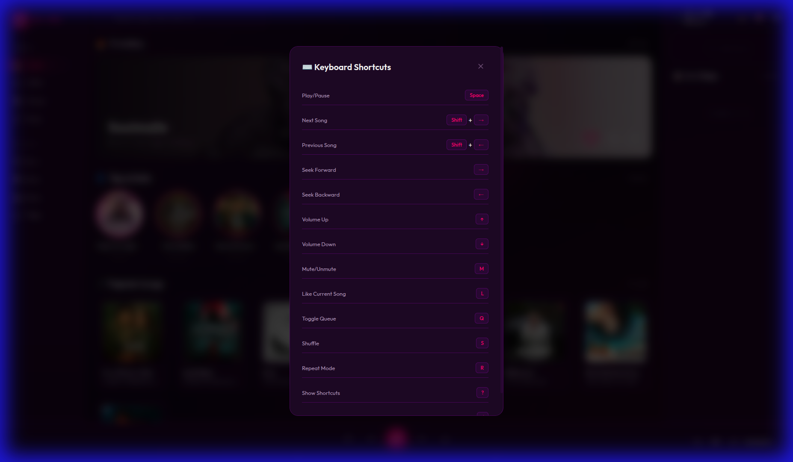

# 🎧 VILLEN Music Player

A premium personal music player with a stunning dark purple/magenta theme, built with Electron and powered by a Django backend.


## 📸 Screenshots

### Main Interface


### Keyboard Shortcuts


## ✨ Features

### 🎨 Premium UI
- **Dark Purple/Magenta Theme** - Stunning glassmorphism design
- **Animated Background** - Pulsing gradients and floating orbs
- **Dynamic Album Blur** - Background adapts to current song
- **Skeleton Loaders** - Smooth loading animations
- **Micro-animations** - Hover effects and transitions

### 🎵 Playback Controls
- Play, Pause, Next, Previous
- Shuffle & Repeat modes
- Volume control with mute
- Draggable progress bar
- Gapless queue management

### 📋 Library Management
- **Trending Songs** - Discover popular tracks
- **Top Artists** - Browse by artist
- **Liked Songs** - Save your favorites
- **Recently Played** - Track listening history
- **Queue** - Manage upcoming songs

### ⚡ Power Features
- **Context Menu** - Right-click for quick actions
- **Keyboard Shortcuts** - Full keyboard control
- **Sleep Timer** - Auto-stop playback
- **Audio Visualizer** - 10-bar frequency display
- **Lyrics Panel** - View song lyrics
- **Media Session** - OS-level controls

## 🚀 Quick Start

### Prerequisites
- Node.js 16+
- Python 3.8+
- npm or yarn

### Backend Setup
```bash
cd backend
pip install -r requirements.txt
python manage.py migrate
python manage.py runserver
```

### Frontend Setup
```bash
cd frontend
npm install
npm start
```

## ⌨️ Keyboard Shortcuts

| Key | Action |
|-----|--------|
| `Space` | Play/Pause |
| `Shift + →` | Next Song |
| `Shift + ←` | Previous Song |
| `→` | Seek Forward 10s |
| `←` | Seek Back 10s |
| `↑` | Volume Up |
| `↓` | Volume Down |
| `M` | Mute/Unmute |
| `L` | Like Current Song |
| `Q` | Toggle Queue |
| `S` | Toggle Shuffle |
| `R` | Cycle Repeat Mode |
| `?` | Show Shortcuts |
| `/` | Focus Search |

## 📁 Project Structure

```
Villen/
├── backend/
│   ├── core/           # Django project settings
│   ├── music/          # Music API app
│   │   ├── views.py    # API endpoints
│   │   ├── urls.py     # URL routing
│   │   └── services/   # JioSaavn integration
│   └── manage.py
│
└── frontend/
    ├── index.html      # Main HTML
    ├── styles.css      # All styles (1100+ lines)
    ├── app.js          # Core logic (900+ lines)
    ├── main.js         # Electron entry
    └── package.json
```

## 🔌 API Endpoints

| Endpoint | Description |
|----------|-------------|
| `GET /api/search/?q=` | Search songs |
| `GET /api/trending/` | Get trending songs |
| `GET /api/stream/{id}/` | Get stream URL |
| `GET /api/song/{id}/lyrics/` | Get lyrics |
| `GET /api/song/{id}/related/` | Get related songs |

## 🛠️ Tech Stack

**Frontend:**
- Electron
- Vanilla JavaScript
- CSS3 with Glassmorphism

**Backend:**
- Django
- Django REST Framework
- JioSaavn API Integration

## 📝 License

MIT License - feel free to use for personal projects.

---

Made with ❤️ by VILLEN
