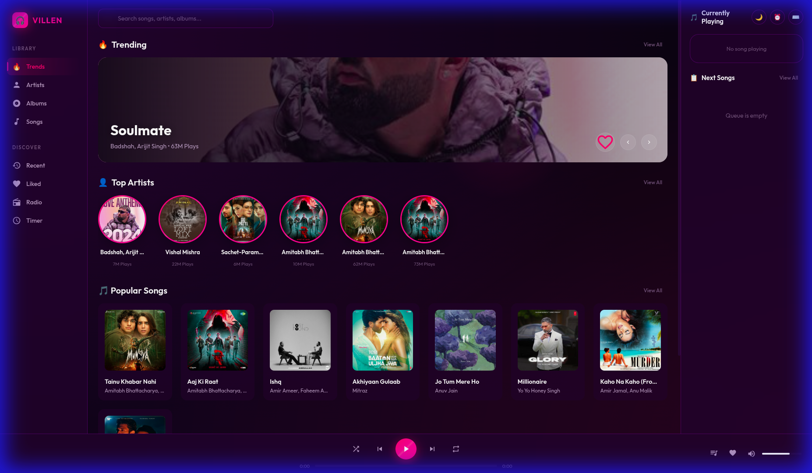

# 🎧 VILLEN Music Player

A premium personal music ecosystem featuring a diverse tech stack:
- **Backend:** Django (Python) - Robust API & Authentication
- **Frontend:** Electron (JS) - Glassmorphism Desktop Player
- **Mobile:** Flutter (Dart) - High-performance Android/iOS App



---

## 🚀 Quick Start (Development)

### 1. Backend (Django)
*The core API server required for both Frontend and Mobile.*

```bash
cd backend
# Create virtual environment (recommended)
python -m venv venv
source venv/bin/activate  # Windows: venv\Scripts\activate

# Install dependencies
pip install -r requirements.txt

# Run migrations & server
python manage.py migrate
python manage.py runserver
```
*Server runs at `http://127.0.0.1:8000`*

### 2. Frontend (Desktop)
*Electron-based desktop player for Windows/Linux.*

```bash
cd frontend
npm install
npm start
```

### 3. Mobile (Flutter)
*Android/iOS application.*

```bash
cd villen_music_flutter
flutter pub get
flutter run
```

---

## 🔄 How to Release Updates

### 1. Backend Updates
*Deploying API changes.*

1.  **Commit & Push:**
    ```bash
    git add .
    git commit -m "feat: new api endpoint"
    git push origin main
    ```
2.  **Auto-Deploy:** If connected to Render/Heroku, pushing to `main` triggers a deploy.
3.  **Database:** If you changed models, run migrations on the server:
    ```bash
    python manage.py migrate
    ```

### 2. Frontend (Desktop) with Auto-Updates
*Building .exe (Windows) and .AppImage (Linux).*

1.  **Bump Version:** Edit `frontend/package.json`:
    ```json
    "version": "1.0.1"
    ```
2.  **Build:**
    - **Linux:** `npm run build:linux`
    - **Windows:** Use Docker (see `frontend/UPDATE.md`) or run `npm run build:win` on a Windows machine.
3.  **Release:**
    - Go to [GitHub Releases](https://github.com/rahulkumar-andc/villen-music/releases).
    - Create a new release (tag `v1.0.1`).
    - Upload the `.exe`, `.AppImage`, and `.deb` files from `frontend/dist/`.

### 3. Mobile (Android) with In-App Updater
*Building APKs that users can auto-update.*

1.  **Bump Version:** Edit `villen_music_flutter/pubspec.yaml`:
    ```yaml
    version: 1.0.1+2
    ```
2.  **Build:**
    ```bash
    cd villen_music_flutter
    # Build split APKs for smaller size (recommended)
    flutter build apk --release --split-per-abi
    ```
3.  **Release:**
    - Create a new [GitHub Release](https://github.com/rahulkumar-andc/villen-music/releases) (tag `v1.0.1`).
    - Upload the APKs (e.g., `app-arm64-v8a-release.apk`).
    - **Magic:** The app checks this GitHub Release on startup. If a newer version exists, it prompts the user to update!

---

## 📂 Project Structure

```
Villen/
├── backend/                # Django REST API
│   ├── core/               # Settings (CORS, JWT)
│   ├── music/              # Music App (Models, Views)
│   └── manage.py
│
├── frontend/               # Electron Desktop App
│   ├── app.js              # Player Logic
│   ├── index.html          # UI Layout
│   └── styles.css          # Glassmorphism Styles
│
└── villen_music_flutter/   # Mobile App
    ├── lib/
    │   ├── providers/      # State Management
    │   ├── services/       # API & Audio Handlers
    │   └── screens/        # UI Pages
    └── pubspec.yaml
```

## ✨ Key Features

- **Premium UI:** Dark purple/magenta glassmorphism theme.
- **Cross-Platform:** Works on Desktop (Electron) and Mobile (Flutter).
- **Auto-Queue:** Automatically plays similar songs when the queue ends.
- **In-App Updates:** Mobile app self-updates via GitHub.
- **Sleep Timer:** Auto-stop playback.
- **Lyrics & Visualizer:** Immersive playback experience.

---

Made with ❤️ by VILLEN
